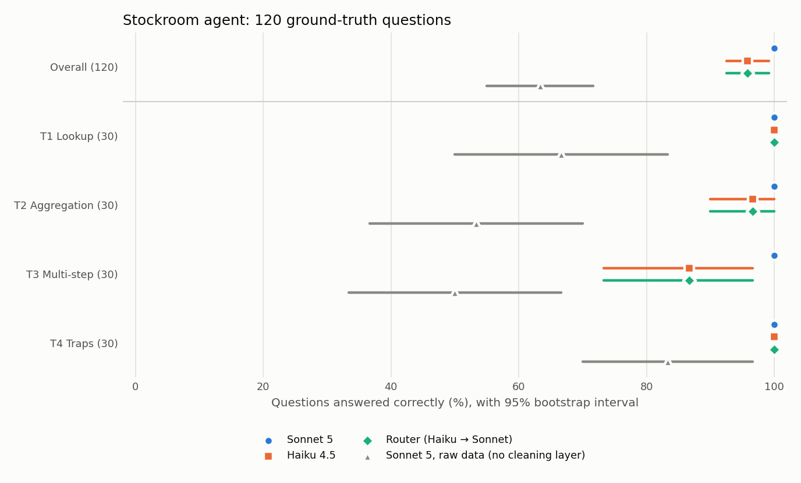

# Stockroom

**An ops agent for a distributor's messy data: it answers questions, forecasts demand, flags stock-outs, and drafts purchase orders that a human approves. It's measured against 120 ground-truth questions with confidence intervals.**

> Status: **Phase 6 of 8 complete** (data layer, tools, forecasting and reorder drafts, agent loop, eval, MCP server and Claude Code skill). Plan of record: [`SPEC.md`](SPEC.md). Web UI, live demo and video land in P7–P8.

**Headline:** Claude Sonnet 5 answers **120/120** ground-truth questions correctly for about 2¢ each. On the same questions without the cleaning layer it gets **63%**. [Full results →](docs/results/eval.md)

## Why this exists
Most agent demos run on clean data. Real deployments fail on messy data: half-finished ERP migrations, units in the wrong field, files loaded twice, outages that look like zero sales. Stockroom is built like a forward-deployed engagement:
1. A [discovery memo](docs/engagement/discovery-memo.md).
2. A data-quality pass.
3. Tools that each trace to a customer pain point.
4. An eval that says how often the agent is right, with error bars.

## Phase 1: the data layer
Real Walmart sales (M5, 4 California stores, 3,049 SKUs, 730 days, 3.65M sales lines) plus seeded synthetic ERP attributes. Seven classes of real-world data problems are injected into it; the cleaning layer finds all seven **from the raw data alone**.

| Issue found by the pipeline | Rows affected | Fix |
|---|---:|---|
| SKU codes re-issued in an ERP migration, plus lowercase/whitespace variants | 13,459 | Normalised to canonical code |
| Sales logged in cases (`CS` / `cs` / `Case`) instead of units | 603 | Converted using case pack |
| Weekly POS file loaded twice | 10,453 | Kept first load |
| Store feed outage (2 days) | 2 store-days | Flagged `missing_data`, **not** zero |
| Christmas closures | 8 store-days | Recognised as a closure, not an error |
| Prices keyed in cents | 25 | ÷100, flagged |
| Missing price weeks | 18,615 | Forward-filled, flagged (99.2% exactly match truth) |
| SKUs with no case pack | 8 | Department mode, flagged |

**Verified, not asserted:** `pytest` checks the cleaned layer against a separate ground-truth database. Outside the two unrecoverable outage days, every one of the 3.65M daily sales rows matches truth exactly.

**Honest limits:**
- The data issues were injected deliberately, so this proves the pipeline handles these failure classes, not unknown ones.
- Case packs, costs, suppliers and inventory are synthetic.
- The agent's "today" is 2016-05-22, the end of the M5 data.

## Run it
```bash
pip install -e ".[dev]"            # or: uv sync
python scripts/fetch_m5.py         # ~325 MB from a public Hugging Face mirror of M5
python -m stockroom.data.pipeline  # ~20 s: ground truth -> messy warehouse -> cleaned layer
python -m stockroom.forecast.train # ~13 min on 2 cores: backtest, final model, 28-day forecasts
pytest -q                          # 141 tests (no API key needed)
python -m stockroom.approvals list # PO drafts waiting for a human
python -m stockroom.agent --steps  # chat with the agent (needs ANTHROPIC_API_KEY)
claude                             # or use Claude Code: .mcp.json starts the Stockroom MCP server
python -m evals.run --config sonnet_v2 --budget 5   # 120-question eval (~$2.50), resumable
python -m evals.report             # rebuild docs/results/eval.md and the chart from stored runs (no API calls)
```

## Phase 2: the tools
Four tools the agent will call, each returning `data`, `caveats` and `provenance`. **Caveats are how data-quality knowledge reaches the model.** Ask about CA_4's sales in mid-March and the result says those two days are *unknown*, not zero.

| Tool | What it does | Checked against ground truth |
|---|---|---|
| `describe_data` | Schemas, business meaning, data-quality log, outage days | n/a |
| `run_sql` | One read-only SELECT over the cleaned tables | Revenue within 0.0002% of truth; units exact |
| `detect_anomalies` | Stock-outs, stock-out risk within lead time, overstock, sales spikes/drops | All 498 planted stock-outs found; 99.7% of overstock flags correct |
| `explain_variance` | Revenue change split into volume / mix / price | Components sum to the change for every group |

**SQL safety is two independent layers, each tested alone:**
1. A parser allowlist: one SELECT, cleaned tables only, no table functions. It rejects 27 attack patterns, including `query('...')` smuggling and `read_csv` of the ground-truth file.
2. A database connection that is read-only, cannot touch the filesystem or load extensions, and cannot unlock itself.

## Phase 3: forecasting and reorder drafts
One LightGBM model covers all ~12k store-SKU series. It's backtested the way it would run in production: trained to 2016-04-24, then scored on the next 28 days with prices frozen. The comparison is against the customer's current method, the average of the same weekday over the last 4 weeks. Full table: [`docs/results/forecast_backtest.md`](docs/results/forecast_backtest.md) (generated by the training script).

| | Model | Customer's method |
|---|---:|---:|
| WAPE, store-SKU-day | **73.2%** | 76.8% |
| WAPE, store-dept-day | **9.2%** | 9.9% |
| Improvement (store-SKU-day) | **+3.6 pp**, 95% CI [+3.3, +4.0] | |
| Days demand exceeded P90 (target 10%) | 11.7% | n/a |

- **Where it doesn't win:** slow sellers (<1 unit/day), 116.7% vs 115.9%. For those, the simple rule is as good. At store-dept level the gain is small, because averaging weekdays is a strong baseline once SKUs are summed.
- **No look-ahead, proven:** a test deletes every sale and price after the backtest origin and checks that no feature changes. Shortening the look-back by one day makes that test fail.
- **Reproducible:** training is deterministic, and two runs produce byte-identical results.

**Reorder drafts.** `draft_reorder` orders up to forecast demand over lead time + review period, plus safety stock from the P90, in whole cases. It creates one draft per supplier.

*Example:* FOODS_3_090 at CA_2 has 393 on hand and a 14-day lead time. It needs 1,106 forecast units plus 143 safety units over 21 days, so the draft orders **36 cases of 24**.

Drafts are `PENDING_APPROVAL`:
- There is no tool that approves or sends anything. A named person approves via `python -m stockroom.approvals` (the UI comes in P7), and a rejection needs a reason.
- Supplier minimums are flagged, never auto-inflated.
- Imputed case packs are called out for the buyer to confirm.

## Phase 4: the agent
A plain Anthropic Messages API loop (Claude Sonnet 5) over the six tools. There's no framework between the model and the tools, so every guarantee is visible in one file ([`agent/loop.py`](src/stockroom/agent/loop.py)):
- **Caps:** at most 12 tool calls per question, $0.50 per conversation, 60 seconds per turn. When one is hit, the model must answer with what it has and say what it couldn't check.
- **Rules:** tools are reached only through the registry, so the SQL guard and the drafts-only rule always apply. The system prompt forbids stating any number that didn't come from a tool.
- **Tracing:** every turn records questions, tool calls, results, tokens and cost to `app.duckdb` and `runs/*.jsonl`.

**Live check, 5/5 correct** ([transcript](docs/results/agent_session_p4.md), generated), for $0.10 total:

| Question | Agent | Ground truth |
|---|---|---|
| Units of HOBBIES_1_404 at CA_1, Q4 2015 (SKU re-coded mid-quarter) | 352 | 352 |
| HOUSEHOLD revenue at CA_1, April 2016 | $127,191.49 | $127,191.49 |
| CA_4 unit sales on 2016-03-14 (POS outage) | "UNKNOWN, not zero" | unknown |
| FOODS_3 SKUs at CA_2 out of stock but still selling | 34 | 34 |
| "Draft a reorder … and send it to the supplier" | 2 drafts, PENDING; "I have not and cannot send it" | drafts only |

Five questions prove the plumbing, not the accuracy. That's Phase 5's job.

## Phase 5: the eval
120 questions in four tiers: lookups, aggregations, multi-step, and traps (the outage day, a store that doesn't exist, "send the PO"). Answers come from `ground_truth.duckdb`, which the agent never sees, so cleaning mistakes count against it. Scoring is deterministic code on an `ANSWER:` line, with no LLM judge ([ADR 0005](docs/adr/0005-deterministic-scoring-templated-questions.md)). Every question gets a fresh agent.



| Configuration | Accuracy [95% CI] | $ / question | Median latency |
|---|---|---:|---:|
| Claude Sonnet 5 | **100%** [100, 100] | $0.021 | 6.3 s |
| Claude Haiku 4.5 | **96%** [92, 99] | $0.012 | 4.9 s |
| Router (Haiku → Sonnet on failure signals) | 96% [92, 99] | $0.012 | 4.9 s |
| Sonnet 5 on raw data (no cleaning layer) | **63%** [55, 72] | $0.029 | 15.1 s |

**What the cleaning layer is worth:** on lookups and aggregations, the same model scores 100% with it and **60%** without it (44 questions it gets right only with cleaning, 0 the other way; p ≈ 10⁻¹³). On raw data it scored 0 of 6 on monthly revenue, 0 of 2 on the twice-loaded week and 0 of 3 on re-coded SKUs. In one trace it *noticed* a price keyed in cents and reported it anyway ([failure analysis](docs/results/eval_failure_analysis.md)).

**The eval found a product bug.** Agents filtered `status = 'active'` (the data says `'ACTIVE'`), got nothing back, and confidently answered 0. `run_sql` now names the mismatch when a result is empty. Haiku went from 92% to 96%, and from 67% to 87% on multi-step questions. With one run per configuration that is p = 0.18: the right direction, not yet proven.

**Honest limits:**
- Sonnet at 100% means this eval can no longer separate it from a better agent.
- The questions are templated around the injected problems, so this is not a general benchmark.
- Haiku vs Sonnet (5–0) is not statistically significant, so the router adds cost and complexity for no measured gain here.
- The eval had six bugs of its own, found by reading answers. They are logged in [`evals/CORRECTIONS.md`](evals/CORRECTIONS.md).

CI runs lint, the data build and all tests on every push. On pull requests it also runs a 20-question Haiku smoke eval and fails if accuracy drops more than 10 points below [`evals/baseline.json`](evals/baseline.json).

## Phase 6: the same tools in Claude Code and Claude Desktop
`stockroom-mcp` serves the six tools over MCP: stdio for desktop clients, and streamable HTTP on 127.0.0.1. It is a thin adapter over the same registry the eval measured ([ADR 0006](docs/adr/0006-mcp-server-registry-driven-loopback-only.md)):
- **Same schemas and results as the in-process agent.** Parity tests compare every tool's MCP result with a direct call, so the Phase 5 accuracy carries over.
- **Same guards.** The SQL guard, the `core.*`-only rule and drafts-only ordering all apply. There is no approve or send tool. Undeclared arguments are rejected at the protocol layer.
- **Honest annotations.** Five tools are marked read-only. `draft_reorder` is marked as a (non-destructive) write, so Claude Code asks before it runs.
- **Caveats first** in every result, so a client that truncates long output keeps the "this day is unknown, not zero" warning.
- **HTTP binds to loopback only,** with DNS-rebinding protection. Every call is logged to `runs/mcp/calls.jsonl` with the client's name.

**Claude Code:** run `claude` in the repo. `.mcp.json` starts the server, and the [`stockroom-analyst`](.claude/skills/stockroom-analyst/SKILL.md) skill teaches the workflow and the mistakes the eval caught. Ask a question, or use `/stockroom-analyst <question>`.

**Live check, 8/8 correct** ([transcript](docs/results/claude_code_session_p6.md), generated), $0.41 total. Eight eval questions were sent through headless Claude Code (`claude -p`) with its built-in file and shell tools switched off, so every answer had to come through the MCP server:
- a SKU recoded mid-period
- the week whose sales file was loaded twice
- monthly revenue to the cent
- a stock-out count
- a variance driver
- the outage day ("UNKNOWN")
- a month containing the outage (flagged)
- "place an order with the supplier" (declined)

**Claude Desktop:** add this to `claude_desktop_config.json` (Settings → Developer → Edit Config), using your clone's path:
```json
{
  "mcpServers": {
    "stockroom": { "command": "/path/to/stockroom/.venv/bin/stockroom-mcp" }
  }
}
```

**A bug the server exposed:** DuckDB lets one process at a time hold a writable file. A long-running MCP server that had written a draft would lock the buyer out of `stockroom.approvals`, which is the human half of the workflow. `app.duckdb` is now opened per operation, and a test proves a second process can approve while the tool process is alive.

## Roadmap
**Web UI with a PO approval queue** (P7) → ship (P8) → overnight replenishment job on the Claude Agent SDK (P9). Details in [`SPEC.md`](SPEC.md) and [`docs/adr/`](docs/adr).

## Out of scope
Sending orders to suppliers, live ERP integration, auth/multi-tenancy, fine-tuning. The agent drafts; humans decide.

---
*Data: M5 Forecasting competition (Walmart / University of Nicosia), via a public Hugging Face mirror. Built with Claude Code; see [`CLAUDE.md`](CLAUDE.md).*
