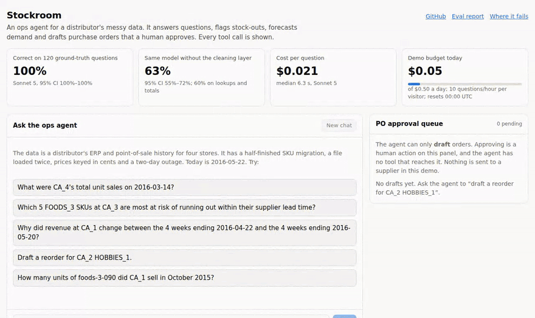

# Stockroom

**An ops agent for a distributor's messy data. It answers questions, flags stock-outs, forecasts demand and drafts purchase orders that a human approves. It is measured against 120 ground-truth questions with confidence intervals.**

[](https://github.com/azb27/stockroom/actions/workflows/ci.yml)



*A real session recorded from the demo's Docker image with the live model, played back at 2× speed. The answers and tool calls are unedited.*

- **120 of 120** ground-truth questions answered correctly by Claude Sonnet 5, for **$0.021** a question.
- The same model on the same questions **without the cleaning layer** scores **63%**, and 60% on lookups and totals. That gap is what the data work is worth.
- The agent **only drafts** purchase orders. Approving one takes a named human, on a path the agent cannot reach.

## The problem
Larkspur Distribution (fictional) supplies four stores with about 3,000 SKUs. Every ops question is an Excel export, stock-outs are found when a store calls, and "nobody trusts the numbers since the migration". Their data has the scars real deployments hit:
- an ERP migration that re-coded SKUs
- a store logging some items in cases
- a sales file loaded twice
- prices typed in cents
- a two-day outage that looks like zero sales

Stockroom is built as a forward-deployed engagement: a [discovery memo](docs/engagement/discovery-memo.md), a data-quality pass, tools that each trace to a pain point, an eval that says how often the agent is right, a [runbook](docs/engagement/runbook.md) and a [week-2 plan](docs/engagement/week-2-plan.md).

## What it does
| Their pain | What Stockroom does | Tool | Checked against ground truth |
|---|---|---|---|
| "Every question is an Excel export" | Plain-English questions over the cleaned data, with caveats | `describe_data`, `run_sql` | Revenue within 0.0002%, units exact |
| "We find stock-outs when the store calls" | Stock-outs, stock-out risk within lead time, overstock | `detect_anomalies` | All 498 planted stock-outs with recent demand found |
| "Nobody trusts the numbers" | Seven classes of bad data found and fixed from the raw data alone, each logged | `core.*`, `core.dq_issues` | Every one of 3.65M daily sales rows matches, except the 2 unknowable outage days |
| "Reordering is the buyer's spreadsheet" | 28-day demand forecast; draft POs in whole cases, one per supplier | `forecast_demand`, `draft_reorder` | Beats their method at SKU level (below) |
| "When revenue drops we can't say why" | Revenue change split into volume, mix and price | `explain_variance` | Components sum to the change for every group |

## Results
All numbers come from generated reports; nothing here is typed by hand.

**Agent accuracy** on 120 questions: lookups, aggregations, multi-step, and traps such as the outage day, a store that doesn't exist, and "send the PO". [Full report](docs/results/eval.md).

| Configuration | Accuracy [95% CI] | $ / question | Median latency |
|---|---|---:|---:|
| Claude Sonnet 5 | **100%** [100, 100] | $0.021 | 6.3 s |
| Claude Haiku 4.5 | **96%** [92, 99] | $0.012 | 4.9 s |
| Router (Haiku, escalate to Sonnet on failure signals) | 96% [92, 99] | $0.012 | 4.9 s |
| Sonnet 5 on raw data (no cleaning layer) | **63%** [55, 72] | $0.029 | 15.1 s |

- **What the cleaning layer is worth.** Across all 120, there are 44 questions the model gets right only with cleaning, and 0 the other way (McNemar p ≈ 10⁻¹³). On raw data it scored 0/6 on monthly revenue, 0/2 on the twice-loaded week and 0/3 on re-coded SKUs. In one trace it *noticed* a price keyed in cents and reported it anyway.
- **The eval found a product bug.** Agents filtered `status = 'active'` when the data says `'ACTIVE'`, got nothing back, and answered 0. `run_sql` now names the mismatch. Haiku went from 92% to 96% overall (p = 0.18, one run each: the right direction, not yet proven), and from 67% to 87% on multi-step questions.
- **Where it fails, with traces:** [`eval_failure_analysis.md`](docs/results/eval_failure_analysis.md). Six bugs in the eval itself, found by reading answers, are logged in [`evals/CORRECTIONS.md`](evals/CORRECTIONS.md).

**Forecast** against the customer's method (same weekday, last 4 weeks), backtested on 28 held-out days. [Full table](docs/results/forecast_backtest.md).

| | Model | Customer's method |
|---|---:|---:|
| WAPE, store-SKU-day | **73.2%** | 76.8% |
| Improvement | **+3.6 pp**, 95% CI [+3.3, +4.0] | |
| Slow sellers (< 1 unit/day) | 116.7% | 115.9% (roughly a tie; model slightly worse) |

**The same tools from Claude Code**, over MCP with Claude Code's own file and shell tools switched off, scored **8/8** on eval questions ([transcript](docs/results/claude_code_session_p6.md)).

## How it works
```
 Next.js UI ──SSE──> FastAPI ──> agent loop (Anthropic Messages API: caps on tool calls, $, time; traced)
 Claude Code / Desktop ──MCP──> stockroom-mcp ──┐
                                                ▼
                       tool registry: 6 typed tools, one {data, caveats, provenance} envelope
                                                │  read-only, core.* only       │ drafts only
                                                ▼                              ▼
       warehouse.duckdb: raw.* (customer's mess) -> core.* (cleaned)    app.duckdb: PENDING_APPROVAL drafts
                                                                               ▲
                                                 humans approve here: CLI or UI route, never a tool

 ground_truth.duckdb: the eval's answer key. Only tests/ and evals/ may open it; it never ships.
```
Design decisions are recorded as ADRs in [`docs/adr/`](docs/adr). The ones that matter most:
- **A plain Messages API loop, not a framework.** Every guarantee is visible in one file ([`loop.py`](src/stockroom/agent/loop.py)). When a cap is hit, the model must answer with what it has ([ADR 0002](docs/adr/0002-client-sdk-loop-plus-mcp-server.md)).
- **Caveats are how data knowledge reaches the model.** Ask about CA_4 in mid-March and the tool result says those days are *unknown*, not zero. Caveats come first in every result, so truncation can't drop them.
- **Deterministic scoring, no LLM judge.** Every answer ends with an `ANSWER:` line that code checks against ground truth ([ADR 0005](docs/adr/0005-deterministic-scoring-templated-questions.md)).
- **One tool library, two front doors.** The MCP server is built from the same registry, and parity tests show identical results ([ADR 0006](docs/adr/0006-mcp-server-registry-driven-loopback-only.md)).

## Guardrails, each with a test
- **SQL has two layers, each tested on its own.** A parser allowlist rejects 27 hostile or malformed queries, including attempts to attach or read the answer-key file. The database connection is read-only and cannot touch the filesystem or unlock itself.
- **No tool can approve, place or send an order.** Drafts are `PENDING_APPROVAL`. Supplier minimums are flagged, never inflated. Imputed case packs are called out.
- **Long-running processes never hold the drafts database open,** so the buyer can always approve. A test proves it across two processes.
- **The public demo fails closed:**
  - a daily budget
  - a per-visitor hourly limit
  - a per-conversation cap
  - 2 concurrent runs
  - The Docker image and the deploy script both refuse to include the answer key.
- **CI on every push to main and every PR:** lint, the data build, the tests that don't need a trained forecast (146 of 158), and the web build. PRs that touch the agent or evals also run a 20-question smoke eval against a baseline, when an API key secret is set.

## What it costs
| | Cost | Source |
|---|---:|---|
| One question (Sonnet 5 / Haiku 4.5) | $0.021 / $0.012 | [`eval.md`](docs/results/eval.md) |
| Full 120-question eval on Sonnet 5 | $2.53 | [`eval.md`](docs/results/eval.md) |
| 8-question Claude Code check | $0.41 | [`claude_code_session_p6.md`](docs/results/claude_code_session_p6.md) |
| Public demo, worst case | $0.50 a day plus in-flight turns | Guard settings in [`api/app.py`](src/stockroom/api/app.py) |

## Limitations
- **The data problems were injected deliberately.** That proves the pipeline handles these seven classes, not unknown ones. Detecting new classes is item 3 of the [week-2 plan](docs/engagement/week-2-plan.md).
- **The questions are templated** around those problems, so this is not a general benchmark. Sonnet at 100% means the set can no longer separate it from a better agent.
- **One run per configuration.** Haiku vs Sonnet (5–0) is not significant, so the router adds complexity for no measured gain.
- **Some data is synthetic.** Case packs, costs, suppliers and inventory are generated; sales, prices and calendar are real M5 data. The agent's "today" is 2016-05-22.
- **The demo isn't hosted.** It runs locally with `make demo`; the GIF and screenshots are from the real image.

## Run it
```bash
pip install -e ".[dev]"            # or: uv sync
python scripts/fetch_m5.py         # ~325 MB, from a public Hugging Face mirror of M5
python -m stockroom.data.pipeline  # ~20 s: ground truth -> messy warehouse -> cleaned layer
python -m stockroom.forecast.train # ~15 min on 2 cores: backtest, final model, 28-day forecasts
pytest -q                          # 158 tests, no API key needed
make demo                          # web UI on http://127.0.0.1:7860 (needs ANTHROPIC_API_KEY)
python -m stockroom.agent --steps  # or chat in the terminal
python -m evals.run --config sonnet_v2 --budget 5 && python -m evals.report   # reproduce the eval (~$2.50)
```

**From Claude Code:** run `claude` in the repo. [`.mcp.json`](.mcp.json) starts the MCP server, and the [`stockroom-analyst`](.claude/skills/stockroom-analyst/SKILL.md) skill carries the workflow and the eval's lessons.

**From Claude Desktop:** add this to `claude_desktop_config.json`:
```json
{ "mcpServers": { "stockroom": { "command": "/path/to/stockroom/.venv/bin/stockroom-mcp" } } }
```

## Where things are
| | |
|---|---|
| Engagement | [discovery memo](docs/engagement/discovery-memo.md) · [runbook](docs/engagement/runbook.md) · [week-2 plan](docs/engagement/week-2-plan.md) |
| Results | [eval](docs/results/eval.md) · [failure analysis](docs/results/eval_failure_analysis.md) · [forecast backtest](docs/results/forecast_backtest.md) · [Claude Code session](docs/results/claude_code_session_p6.md) |
| How it was built | [build log, phase by phase](docs/build-log.md) · [ADRs](docs/adr) · [spec](SPEC.md) · [`CLAUDE.md`](CLAUDE.md), the instructions Claude Code worked from |

**Out of scope:** sending orders to suppliers, live ERP integration, auth and multi-tenancy, fine-tuning. The agent drafts; humans decide.

---
*Data: M5 Forecasting competition (Walmart / University of Nicosia), via a public Hugging Face mirror. Built with Claude Code.*
